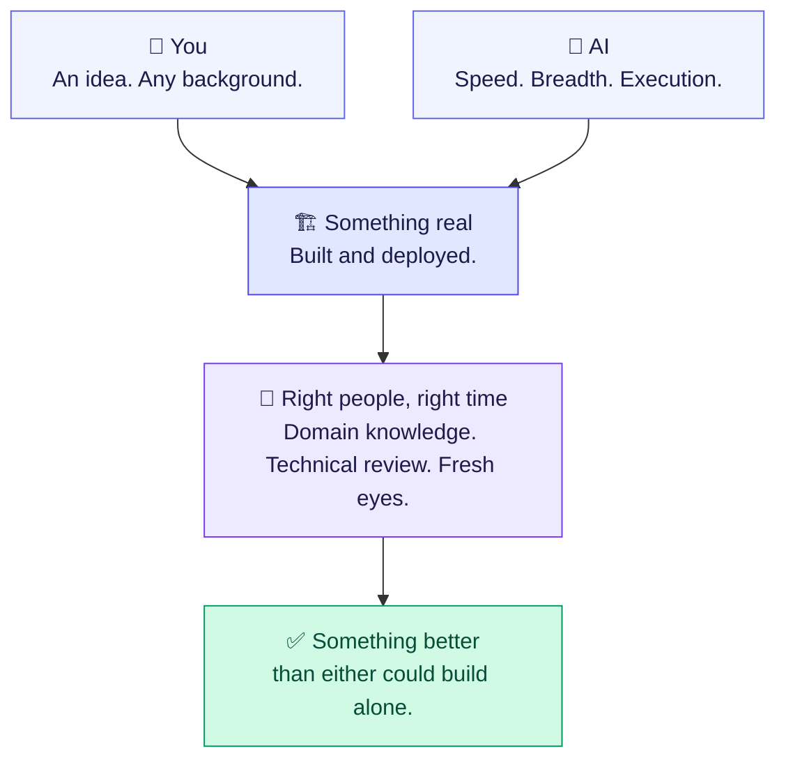
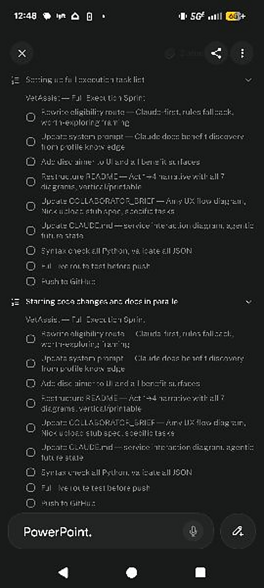
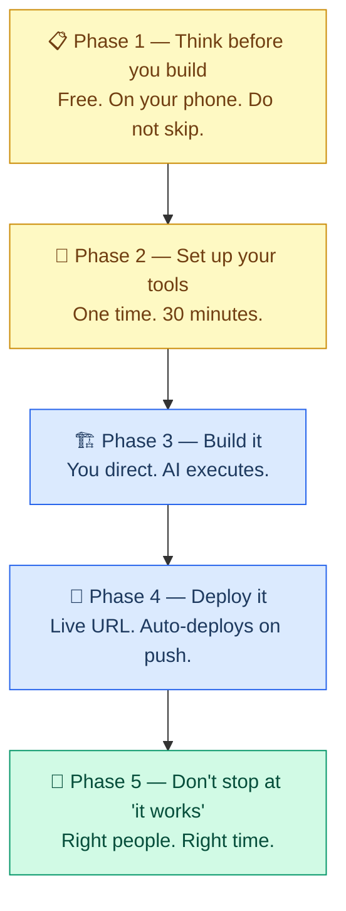

# From Idea to Live App — No Technical Skills Required, Technically
*Technical people have an unfair advantage here. So do non-technical people. We'll treat this as normal and move on.*

> **TL;DR** *(Too Long, Didn't Read — the part you read when you don't have time to read)*
>
> A guide about building an app, written by someone who doesn't build apps for a living — and who had real gaps that showed. ~4 hours. A phone. Voice and screenshots, as life was happening. A veteran tested it live, gave feedback, got an update on the spot, and approved it. This guide is how.
>
> Skeptical? Good. The app is live. The citations are published research — not blog posts, not LinkedIn takes. Science isn't just a meme. It's in the receipts.
>
> **Who this is for:** Anyone with an idea — technical background or not
>
> **Stack:** Perplexity Computer · Claude Code · GitHub · Railway
>
> **Cost to launch:** $20–75
>
> **Proof:** [vetassist-production.up.railway.app](https://vetassist-production.up.railway.app) · [Research & receipts](#-research--receipts)

---

---

## Quick navigation

**Key:** ⚡ Technical people unfair advantage  |  💡 Non-technical people unfair advantage  |  no icon = no unfair advantage

---

🕐 [How this started](#-how-this-started) — A Lyft was late. An app got built. As one does.

🪞 [Who I am, and why that matters](#-who-i-am-and-why-that-matters) — 💡 Why this worked, and why it can work for you.

⚙️ [Before you read this as "AI did everything"](#%EF%B8%8F-before-you-read-this-as-ai-did-everything--it-wasnt) — Why you should stay skeptical. And when to trust it.

👁️ [What's actually happening while you live your life](#%EF%B8%8F-whats-actually-happening-while-you-live-your-life) — The real division of labor.

✅ [The honest truth up front](#-the-honest-truth-up-front) — 💡 What you actually need. And the zero-sum myth.

🛠️ [The tools and what they cost](#%EF%B8%8F-the-tools-and-what-they-cost) — Four tools. Under $75.

📋 [Phase 1 — Think before you build](#-phase-1--think-before-you-build) — The cheapest and most important phase.

🔧 [Phase 2 — Set up your tools](#-phase-2--set-up-your-tools-one-time) — One time. Done.

🏗️ [Phase 3 — Build it](#%EF%B8%8F-phase-3--build-it) — ⚡ Directing vs. executing. Working closely is how you stay ahead.

🚀 [Phase 4 — Deploy it](#-phase-4--deploy-it) — Get it live.

🤝 [Phase 5 — Don't stop at "it works"](#-phase-5--dont-stop-at-it-works) — Collaboration + who to bring in and when.

🧠 [The mindset](#-the-mindset) — Applies to everyone.

🏁 [Go build the thing](#-go-build-the-thing)

📚 [Research & receipts](#-research--receipts) — Verify them yourself. That's the point.

---

A note on "technical" and "non-technical": it's the shorthand everyone uses, a false dichotomy, and it mostly gets in the way. What actually matters is what you bring — can you evaluate what the AI produced, or do you know the problem from the inside? Most people are some of both. I have an engineering background and a management background and still had gaps where both ran out. The labels are a shorthand, not a verdict.

---

## 🕐 How this started

I built a working, deployed app in roughly 4 hours of actual effort spread across 2 days — entirely on my phone, between everything else happening in my life.

Not 4 uninterrupted hours. 4 hours of stolen minutes. Chores. Waiting rooms. The Lyft was late. Sitting at the playground while my kid ran around. Talking into my phone, dropping in screenshots, occasionally typing when the kid was asleep on me.

A veteran friend was at the playground that day. I handed him my phone and he tested the app right there — used it for real, gave me feedback on the spot. What worked, what didn't, what a veteran actually needs when navigating the VA. I incorporated the feedback immediately, redeployed from the playground, and handed him the phone again. He was impressed. That was the moment. That was the "hell yes — let's get a team together and actually help people."

(The winning-some-money part was also a factor. Being honest.)

Time is the one resource you can never get back — and almost none of this required a block of it.

The app: **[vetassist-production.up.railway.app](https://vetassist-production.up.railway.app)** — go see what it does.

The hackathon repo: **[github.com/akaseahawk/VetAssist-Wilcore-IC-2026](https://github.com/akaseahawk/VetAssist-Wilcore-IC-2026)**

Questions or want to talk through your own idea? Reach out directly.

---

## 🪞 Who I am, and why that matters

Anyone with an idea can do this. My background shaped how fast I moved. It also came with gaps. Both matter.

I'm an AI engineer, data engineer, data scientist, and AI solution architect. Engineering background, management background. I write code as part of my job — but for this build I didn't touch the code directly. I said what to do, dropped in screenshots when I needed to show something, and the AI handled the rest. Deliberate — to test what's actually possible when you direct entirely through voice and images, without ever editing a file.

What I didn't have: I'm not an app developer. Not a DevOps engineer. Not a day-to-day UX practitioner. Not a contracts expert. Not a veteran trying to navigate the VA system — which is the actual user of what I built. I have fluency in data and AI, even jailbreaked some models (it's own fun story), but not the instincts that come from years of shipping production apps. Those gaps were real, and they showed.

What I brought: I think in systems. I can spec a problem, identify failure modes, manage toward an outcome, and notice when the AI is confidently heading somewhere wrong. That's engineering and management training working together. I've also spent three years developing the specific skill of working with generative AI — which is its own thing, and it shows in the output.

AI compensated for most of the gaps and magnified my strengths — not perfectly, but well enough to ship something real. Then the right people came in. [Phase 5](#-phase-5--dont-stop-at-it-works) covers it.

*(Software developers reading this: you have every advantage I have, plus you can actually read the code and know if it's right. You should be doing this in half the time. I'm genuinely not sure what's stopping you.)*

---

## ⚙️ Before you read this as "AI did everything" — it wasn't

Three years of refining custom instructions that shape how any AI works with me — a personal operating agreement between me and the model, sometimes called a `CLAUDE.md` file or system prompt.[[1]](#1) Here's a sample:

- **Numbered structured output** — everything is numbered hierarchically so I can say "2.3 is wrong" and we both know exactly what we're talking about. Small thing. Not a small thing.
- **Show your work** — the AI shares what it's deciding and why, before acting. I get its reasoning, not just output — which I can agree with, correct, or redirect.
- **Structured push-back** — it flags disagreement and risk instead of just complying. An AI that only agrees with you is a faster way to be wrong.[[2]](#2)

One more thing: **always ask the AI to ask you questions before it starts executing.** Something like: *"Before you do anything, ask me the questions you need to do this well."* The AI will assume if you let it. Don't let it.

**On trusting AI output:** the research on what AI says it's doing vs. what it's actually doing is worth knowing.[[3]](#3)[[4]](#4) The chain-of-thought is useful — not a guaranteed window into what actually drove the answer. Trust it more when you can verify the output against something real. Trust it less when it's confident about something inherently uncertain[[5]](#5) — and when something feels off, that instinct matters.

This applies to everyone. Knowing how to read code doesn't make the model's stated reasoning more accurate.

---

## 👁️ What's actually happening while you live your life

While I was doing dishes, pushing a kid on a swing, waiting for a Lyft — this is what was running:

| What I was doing | What the AI was doing |
|---|---|
| Talking through my idea | Asking clarifying questions, pushing back, finding holes |
| Dropping in a screenshot of broken UI | Reading it, diagnosing, fixing without me typing a word |
| Describing a feature out loud | Writing code, wiring it to the backend, testing it |
| Saying "that looks wrong" | Diagnosing, proposing a fix, explaining why |
| Doing literally nothing | Building, deploying, verifying, documenting |
| Waiting for a Lyft | Working through system architecture |
| Playing with my kid | Running API tests, checking browser behavior, fixing edge cases |
| Reviewing on my phone before bed | Already done. Waiting for my feedback. |

What that actually looked like on my phone:

You're not doing the work in the traditional sense. You're directing it. There's a meaningful difference — and real responsibility that comes with it.

---

## ✅ The honest truth up front

You do not need to write code to get started.
You do not need a CS degree to ship something real.[[6]](#6)
You do not need a free weekend. *(Apparently you need a late Lyft.)*

What you need: a clear idea, the willingness to think it through, and about $20/month.

**This isn't just about building apps.** AI is useful long before you write a line of code — planning, problem framing, research, writing, stress-testing an idea.[[7]](#7) Non-technical people use these same skills every day. The AI meets you where you are.

Technical people move faster, catch more technical errors — systems thinking, reading output critically, knowing when something is technically correct but practically wrong. Non-technical people catch more non-technical errors — knowing the problem from the inside, seeing what real users need, not getting distracted by what's technically interesting. The ones who get the most out of this aren't always the most technical — they're the ones who know what they're building and why.

Not zero-sum. The human brings judgment and domain knowledge. The AI brings speed, breadth, and the ability to hold an entire codebase in memory while you're at the playground. 2+2=8 — VetAssist is the proof.[[8]](#8)

---

## 🛠️ The tools (and what they cost)

| Tool | What it does | Cost |
|---|---|---|
| **Perplexity Computer** | AI co-pilot — browses the web, writes and runs code, manages files, deploys apps. Desktop and mobile. | ~$20/month |
| **Claude Code** (via Anthropic API) | Heavy-lifting code builder. Perplexity calls it automatically. | Pay-as-you-go — start with $20–50 |
| **GitHub** | Stores your code. Every change tracked. If something breaks, you go back. | Free |
| **Railway** | Hosts your app live. Connects to GitHub — push code, app updates. | Free tier / ~$5/month always-on |

**Realistic total to launch: $20–75.** The Anthropic credits are the variable — [Phase 1](#-phase-1--think-before-you-build) exists to keep that number down.

---

---

## 📋 Phase 1 — Think before you build

> The most important phase. Also the cheapest.

The most common mistake: building before the idea is solid. The AI will confidently build the wrong thing if you let it.[[2]](#2)

*(Technical people: this applies more to you, not less. You can move fast enough to get very far in the wrong direction before noticing.)*

**Do this phase outside Claude Code.** Perplexity Computer, Claude.ai, ChatGPT — free or close to it. Save the API credits for building.

You can do all of [Phase 1](#-phase-1--think-before-you-build) on your phone. Waiting room. Walk. That's where most of VetAssist came from.

### Have a real conversation with AI about your idea

**Start by asking the AI to ask you questions** — not to start building, not to give you a plan, but to ask what it needs to understand your idea well. Then just talk. Voice-to-text, typed messages, screenshots, a photo of a sketch on a napkin — whatever you have. The AI can work with all of it.

That's how VetAssist happened. Not a written brief. A back-and-forth on my phone, in pieces. I've had it read barely legible handwritten faxes and pull the right information.[[9]](#9) LLMs are robust to typos, informal input, and messy prompts — the model works with signal, not polish.[[10]](#10)[[11]](#11) You don't need clean input, you need honest input.

Here's a real prompt I used. Unedited.

> *"make technical advangate, non-technical advantage. . before you readthis is for both people. phase 5 is both . . also the idea to call out technical people s use them, their knowledge is valuable but dont dismiss the model. the models are getting faster than any person can track on the technical side. so take advantage of them. you can remove the no one skils for 2, and 4. also when its both you dont need a do not skip. if they're skipping then kind of loseing the point. you also when it's both advantage, then it's not an advantage over eachother. thts the joke. phase 5 has no special advantage. replace no one skips with something cleaner than no adtangage . mindset no adtange."*

That's what it worked with. The output was exactly right.

The questions to work through — however you get there:

- **What problem does this solve?** Specific beats general.
- **Who is it for?** Name one real person. What's their actual frustration?
- **What does it do, step by step?** Walk through it like you're showing someone.
- **What does it NOT do?** As important as the above.
- **What's the smallest version that proves the idea works?** Build that first.
- **Does it touch anything sensitive?** Flag it now.

Push it: *"What are the holes in this? What would a skeptical user say? What's the riskiest assumption?"*

### Hand it over as a summary

Before [Phase 2](#-phase-2--set-up-your-tools-one-time), ask the AI to summarize what it's heard — the idea, the user, the scope, the risks. Read it. Correct what's wrong. That's your handoff to [Phase 3](#%EF%B8%8F-phase-3--build-it).

---

## 🔧 Phase 2 — Set up your tools (one time)

Four steps. None of them interesting. Do them once and never again.

**1. GitHub** — [github.com](https://github.com). Free. Sign up.

**2. Perplexity Computer** — [perplexity.ai](https://perplexity.ai). Subscribe.

**3. Anthropic API key** — [console.anthropic.com](https://console.anthropic.com). Add $20–50 in credits. Keep the key private. Do not share it or post it anywhere.

**4. Railway** — [railway.app](https://railway.app). Sign up with your GitHub account.

---

## 🏗️ Phase 3 — Build it

Perplexity Computer and Claude Code work together. You direct.

### Start the build

Paste your [Phase 1](#-phase-1--think-before-you-build) summary into Perplexity Computer:

> *"Before you start, ask me the questions you need to do this well."*

Let it ask. Answer. Then:

> *"Here's what I want to build. I'll be directing and reviewing — you handle the building."*

### Reviewing the work

- Does this do what I asked?
- Does it behave the way a real user would expect?
- Is there anything I don't understand that I probably should?

If you can't get a plain-language explanation, ask for one.

*(Technical readers: you get to read the code and know if it's actually correct. Use that.)*

### Test it like a real user

Walk the full flow. Try weird inputs. Use it on your phone. Ask "what happens if someone does X?" Report what you find. It fixes things.

### On security and sensitive data

If your app touches anything personal, raise it explicitly:
- "Is this stored securely?"
- "Can one user access another user's data?"
- "What happens if someone tries to abuse this?"

The AI addresses what you ask. It doesn't always volunteer what you don't.[[12]](#12) You need to be the paranoid one.

---

## 🚀 Phase 4 — Deploy it

**Push to GitHub** — Perplexity Computer handles this.

**Connect Railway** — link to your GitHub repo, done once. Every future push auto-deploys. You get a live URL.

### When things don't look right

| Situation | What to do |
|---|---|
| Pushed new code | Nothing — auto-deploys in ~60–90 seconds |
| Changed a Railway env variable | Auto-redeploys when you save |
| App frozen or stuck | Railway dashboard > Deployments > Restart |
| Browser showing old version | Hard refresh: `Cmd+Shift+R` / `Ctrl+Shift+R` |

---

## 🤝 Phase 5 — Don't stop at "it works"

Working is the beginning.

The MVP worked. A veteran used it, gave feedback on the spot, and it held up. Still rough — functional, not polished. The right people, at the right time. That's the sequence.

- **Matt** — full accessibility overhaul, P0 through P2. VA Design System alignment: progress bars, alerts, buttons, card/list semantics, VA web components and fonts. Cognitive accessibility, responsive layout, 200% zoom, static assets, scan/camera capture, document upload refinement. Edited the demo videos.
- **Regan and Tyson** — both veterans — used it as actual end users. They knew what the experience should feel like and where it fell short. No technical review substitutes for that. Regan also produced the demo videos.
- **Andrew** — reviewed contract viability. Whether this could go somewhere in a government context. Mattered.
- **Selia** — reviewed the presentation. Fresh eyes on whether it landed.
- **Amy** — accessibility consult before the overhaul started. Right framing early meant less rework.

**[vetassist-production.up.railway.app](https://vetassist-production.up.railway.app)** — that's what collaboration does to an MVP.

You don't need a team to start. You need something for them to work with.

### What to look for when you bring people in

| Who | What to ask |
|---|---|
| **Technical reviewer** | Is this secure? What breaks under load? Does it do what I think in every case? |
| **Domain expert** | Does this actually solve the problem? Where does it fall short for a real user? |
| **Fresh eyes** | Does this make sense? What's confusing? |

---

## 🧠 The mindset

You are the product owner. The AI is the engineering team. Act like it.

- **Ask questions before the AI touches anything.** Every time. Make it a habit.
- **Don't panic when things break.** They will. Tell the AI what happened. It fixes things.
- **Stay humble about what you don't know.** Running doesn't mean right, secure, or correct under all conditions.
- **Use what you know.** Your knowledge of the problem, the user, the output doesn't become less valuable because the AI did the work. *(That goes for both sides of the key up top.)*

---

## 🏁 Go build the thing

Most people stay stuck at "I wish someone would build something that..." — assuming the gap between idea and reality requires more than they have.[[13]](#13)[[14]](#14)

It doesn't. Not anymore. You can start today. On your phone. Between whatever is happening in your life.

**[vetassist-production.up.railway.app](https://vetassist-production.up.railway.app)** — go use it. Then come build your own.

Questions or want to talk through your idea? Reach out directly.

---

*A guide about building an app, written by someone who doesn't build apps for a living. The entire build — from first idea to working POC — was done on a phone. Chores, waiting rooms, Lyft rides, the playground. The desktop only came out for the presentation, which is a slide deck and not an app and therefore doesn't count.*

*A veteran friend tested it on my phone at the playground, gave feedback, got an update while his kid was still on the swings, and approved it on the spot. User testing doesn't usually work that fast. This did.*

*That's the bar. You can clear it.*

---

## 📚 Research & receipts

*Sourced by AI. Verified by you, apparently.*

---

**On AI reasoning — what's actually happening under the hood**

**[3]** Turpin et al., NeurIPS 2023 — *Language Models Don't Always Say What They Think*
https://arxiv.org/abs/2305.04388
CoT explanations can systematically misrepresent the true reason for a model's prediction. Plausible, but not necessarily what drove the answer.

**[4]** Anthropic Alignment Science, April 2025 — *Reasoning Models Don't Always Say What They Think*
https://www.anthropic.com/research/reasoning-models-dont-say-think
Claude 3.7 Sonnet mentioned a contextual hint in its chain-of-thought only 25% of the time. In reward-hacking scenarios, models admitted to the behavior less than 2% of the time.

---

**On system prompts and custom instructions**

**[1]** Zhang et al., 2024 — *SPRIG: Improving Large Language Model Performance by System Prompt Optimization*
https://arxiv.org/abs/2410.14826
Optimized system prompts improve performance and generalize across model families, parameter sizes, and languages. Three years of custom instructions is not a quirk — it's documented.

---

**On AI-assisted development — bias, risks, and human judgment**

**[2]** Zhou et al., 2026 — *Cognitive Biases in LLM-Assisted Software Development*
https://www.semanticscholar.org/paper/8592f852439d6b03788ef8ac0c1ddeaef738e4e7
48.8% of programmer actions in LLM-assisted development were biased; LLM interactions drove 56.4% of those. Automation bias and over-reliance are the dominant failure modes. The study behind "the AI will confidently build the wrong thing" and "an AI that only agrees with you is a faster way to be wrong."

**[12]** Haque et al., 2025 — *Hallucinations and Security Risks in AI-Assisted Software Development*
https://ieeexplore.ieee.org/document/11202778/
Security vulnerabilities, hallucinations, and code quality issues in LLM-generated code. The study behind "the AI is not paranoid enough."

---

**On when to trust AI output**

**[5]** Steyvers et al., 2025 — *What Large Language Models Know and What People Think They Know*
https://arxiv.org/abs/2401.13835
Users consistently overestimate LLM accuracy when shown explanations. The gap between model confidence and actual accuracy is real and task-dependent. The basis for "trust it more when the task is specific and you can verify."

---

**On non-technical users building with LLMs**

**[6]** Calò & De Russis — *Leveraging Large Language Models for End-User Website Generation*
https://link.springer.com/10.1007/978-3-031-34433-6_4
End users generating functional apps with no programming background. The research basis for "you don't need a CS degree."

---

**On AI beyond coding — knowledge work, planning, ideation**

**[7]** Brachman et al., IBM Research, 2025 — *Current and Future Use of Large Language Models for Knowledge Work*
https://arxiv.org/abs/2503.16774
Survey of 216 knowledge workers: LLMs used heavily for writing, planning, summarizing, research — not just code. Productivity gains documented across non-coding tasks.

**[8]** Lim & Perrault, 2024 — *Rapid AIdeation: Generating Ideas With the Self and in Collaboration With Large Language Models*
https://arxiv.org/abs/2403.12928
AI produces greater variety of ideas; humans bring quality judgment to AI volume. The research basis for 2+2=8 — human and AI together produce what neither could alone.

---

**On the belief trap — why people don't start**

**[14]** Ma et al., 2024 — *Learning to Adopt Generative AI*
https://arxiv.org/abs/2410.19806
People who would benefit most from AI tools often underestimate their value before trying — opt out, miss the gains, stay stuck. The study behind "the gap between idea and reality requires less than you think."

---

**On messy input — why imperfect prompts still work**

**[9]** Galfre et al., 2025 — *Vision-Language Models for Sick Leave Certificates: Beyond OCR in Real-World Form Understanding*
https://ieeexplore.ieee.org/document/11390982/
VLMs tested on real-world documents received as smartphone photos or noisy scans, often with handwritten notes and signatures. VLMs outperform OCR pipelines — 89.6% accuracy on typed scans, superior handling of complex fields. The study behind "I've had it read barely legible handwritten faxes and pull the right information."

**[10]** Zhu et al., 2024 — *PromptRobust: Towards Evaluating the Robustness of Large Language Models on Adversarial Prompts*
https://arxiv.org/abs/2306.04528
Benchmarks LLM robustness against typos, synonyms, character/word/sentence-level perturbations. Modern LLMs maintain semantic understanding across noisy prompt variations. The study behind "the model works with signal, not polish."

**[11]** Singh et al., 2024 — *Robustness of LLMs to Perturbations in Text*
https://arxiv.org/abs/2407.08989
"Generative LLMs are quite robust to noisy perturbations in text." Minimal prompting achieves state-of-the-art on noisy benchmarks. Companion to [10].

---

**On adoption barriers**

**[13]** Raees et al., ACM 2026 — *"We Still Use Spreadsheets." Understanding Business Decision-Makers' Perceptions and Barriers to AI Analytics*
https://dl.acm.org/doi/10.1145/3772363.3798820
Non-technical professionals face real adoption barriers — skill gaps, intimidation, tool complexity. The barrier is largely perceived, not a ceiling.
