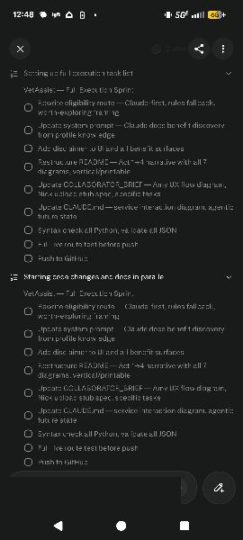
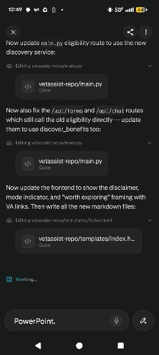

# From Idea to Live App — No Technical Skills Required, Technically
*Technical skills do give you unfair advantages. We'll get to that.*

> This is a test case and a how-to guide. Not a tutorial written by someone
> who read about this. A real account of what I actually did — written entirely
> in my own voice, on my phone, as it was happening.
>
> This is a guide about building software, written by someone who does not write
> software for a living. We'll proceed anyway.
>
> If you have an idea — technical background or not — this is for you.

---

## Quick navigation

**Not technical? Start here:**
- [How this started](#how-this-started) — the story
- [What's actually happening while you live your life](#whats-actually-happening-while-you-live-your-life) — what the AI is doing
- [The honest truth up front](#the-honest-truth-up-front) — what you actually need
- [The tools and what they cost](#the-tools-and-what-they-cost)
- [Phase 1 — Think before you build](#phase-1--think-before-you-build) ← start here
- [Phase 2 — Set up your tools](#phase-2--set-up-your-tools-one-time)
- [Phase 3 — Build it](#phase-3--build-it)
- [Phase 4 — Deploy it](#phase-4--deploy-it)
- [Phase 5 — Don't stop at "it works"](#phase-5--dont-stop-at-it-works)
- [What this costs](#what-this-costs)
- [Go build the thing](#go-build-the-thing)

**Already technical? Jump to what's relevant:**
- [Who I am and why that matters](#who-i-am-and-why-that-matters) — background and why it's relevant
- [Before you read this as "AI did everything"](#before-you-read-this-as-ai-did-everything-and-it-was-magic--it-wasnt) — custom instructions, system prompts, the research
- [What's actually happening while you live your life](#whats-actually-happening-while-you-live-your-life) — the real division of labor
- [Phase 3 — Build it](#phase-3--build-it) — directing vs. executing, your unfair advantages
- [Phase 5 — Don't stop at "it works"](#phase-5--dont-stop-at-it-works) — where your skills multiply everything
- [The mindset](#the-mindset) — the technical multiplier

---

## How this started

Time is the one resource you can never get back. This is about making the most
of the minutes you actually have.

I built a working, deployed web application in roughly 4 hours of actual effort
spread across 2 days.

Not 4 uninterrupted hours. 4 hours of stolen minutes — entirely on my phone.

Between chores. Waiting rooms. Waiting for a Lyft. *(The Lyft was late. I used the
time to work through the system architecture. This was not planned but worked out
well.)* Sitting at the playground in between actually playing with my kid. A minute
here, a few minutes there — a glance at the phone while the kid runs, a voice note
while I'm walking over. Responsibly watching a child at a playground is not a
perfect time to build software. It turned out to be plenty of time.

From the first idea to a working POC to showing it to a veteran friend while we
watched our kids run around — all of it was on my phone. Talking, typing, reviewing,
directing.

The desktop didn't come in until we were building out the presentation for the final
hackathon submission. The app itself? Phone start to finish.

He used it on my phone at the playground. On the spot. That's when I knew it was real.

There is no perfect time. That's not a productivity tip — it's just what I found to be
true. You say something, wait for things to happen, review when a moment opens up.
The moments were real. The product was real.

What the team built on top of that POC is a different story. This one is about the
part that happened first — what one person can do, alone, on a phone, between life.

This guide exists because I think a lot of people — technical and non-technical —
have ideas sitting in their heads that they assume require more than they have:
more time, more money, more skills, more help. I wanted to demonstrate what's
actually possible right now, and show exactly how I did it so you can too.

The app itself? You can find it at
**[vetassist-production.up.railway.app](https://vetassist-production.up.railway.app)**
— go see what it does. I'll let it speak for itself.

If you want to see what the team turned that POC into for the Wilcore Innovation
Challenge, the full hackathon version is at the same URL — same app, grown up a bit.
The repo is here:
**[github.com/akaseahawk/VetAssist-Wilcore-IC-2026](https://github.com/akaseahawk/VetAssist-Wilcore-IC-2026)**

Questions or want to talk through your own idea? Reach out to me directly.

---

## Who I am, and why that matters

I have a biomedical engineering degree and a background in engineering management.
My day job is AI engineering, data science, data engineering, and AI architecture.
I am not a software developer. I write code — but I don't build production web
applications for a living.

I tell you this because it's relevant to what happened.

I think in systems. I know how to spec a problem, identify failure modes, manage
toward an outcome, and fill in the gaps an AI leaves. I also care deeply about
veteran healthcare — the biomedical background didn't go anywhere, it just found
a different application. VetAssist exists partly because I'm genuinely nerdy about
medical systems and what happens when people can't navigate them.

Working with the current generation of AI is, fundamentally, engineering management.
You are managing a very fast, very capable, occasionally overconfident team member
who needs clear direction, structured feedback, and someone to notice when it's
confidently heading in the wrong direction. That is a skill. I've been developing it
for about 3 years.

That background helped me move faster. You don't need the same background to do this —
you'll do it at your own pace, which is still faster than waiting for a perfect time
that isn't coming.

*(If you're a software developer reading this: you have every advantage I have, plus
the ability to read the code it writes and actually know if it's wrong. You should
be doing this in half the time. I'm not sure why you aren't.)*

---

## Before you read this as "AI did everything and it was magic" — it wasn't

Three years of refining a set of custom instructions that shape how any AI works
with me. Think of it as a personal operating agreement between me and the model —
sometimes called a `CLAUDE.md` file or system prompt. The AI community has been
writing about this pattern a lot lately. Here's what mine includes:

- **Numbered structured output** — everything the AI produces is numbered
  hierarchically (1.1, 1.2.3, etc.) so I can say "what you said at 2.3 is wrong"
  or "explain 4.1.2" and we both know exactly what we're talking about. This
  sounds like a small thing. It is not a small thing.
- **Show your work** — the AI shares what it's deciding, considers alternatives,
  and gives me a pro/con/reason before acting. I'm not just getting output,
  I'm getting its thinking — which I can then agree with, correct, or redirect.
- **Structured push-back** — it's set up to flag when it disagrees or sees a risk,
  not just comply and move on. An AI that only agrees with you is just a faster
  way to be wrong.

The tools got dramatically better over those 3 years. So did my ability to work
with them. The result still blew my mind. But it didn't come from nowhere —
I set it up for success.

**One honest caveat on AI reasoning:** research shows that what an LLM says it's
doing isn't always what it's actually doing under the hood. The chain-of-thought
explanation is useful — just not a guaranteed window into the model's true process.
Two studies worth knowing about:

- [*Reasoning Models Don't Always Say What They Think*](https://www.anthropic.com/research/reasoning-models-dont-say-think)
  — Anthropic's alignment science team (2025): chain-of-thought reasoning can be
  unfaithful to the model's actual internal process.
- [*Language Models Don't Always Say What They Think*](https://arxiv.org/abs/2305.04388)
  — Turpin et al., NeurIPS 2023: CoT explanations can systematically misrepresent
  the true reason for a model's prediction. Plausible, but misleading.

Still useful. Just not gospel. Stay engaged, keep asking questions, don't treat the
AI's self-reported reasoning as ground truth. Which is, incidentally, good advice
for dealing with most people too.

---

## What's actually happening while you live your life

Here's the part that took me a minute to internalize. While I was doing dishes,
or pushing a kid on a swing, or waiting for a Lyft — this is what was actually running:

| What I was doing | What the AI was doing |
|---|---|
| Talking through my idea on my phone | Asking clarifying questions, pushing back, finding the holes |
| Describing a feature out loud | Writing the code, wiring it to the backend, testing it |
| Saying "that looks wrong" | Diagnosing the problem, proposing a fix, explaining why |
| Doing literally nothing | Building, deploying, verifying, documenting |
| Waiting for a Lyft | Working through system architecture. The Lyft was late. |
| Playing with my kid | Running API tests, checking browser behavior, fixing edge cases |
| Reviewing on my phone before bed | Already done. Waiting for my feedback. |

Here's what that actually looked like on my phone — Perplexity Computer and Claude
Code working through the VetAssist sprint while I was living my life:

That's the shift. You're not doing the work in the traditional sense.
You're directing it. There's a meaningful difference — and it comes with real
responsibility, which I'll get to.

---

## The honest truth up front

You do not need to write code to get started.
You do not need a computer science degree to ship something real.
You do not need a free weekend. *(Apparently you need a late Lyft.)*

What you need: a clear idea, the willingness to think it through, and about $20/month.

If you have a technical background — in any discipline — it amplifies everything here.
Systems thinking, domain knowledge, the ability to read what the AI wrote and know
if it's actually right: all of it matters. None of it is required to start.

That said — getting something working is not the same as getting something right.
A prototype that runs is a starting point, not a finish line. At some point, especially
if real people are going to use your app and rely on it, you want technical eyes on it.
Someone who can check whether it's secure, whether it handles edge cases, whether it
does what you think it does under the hood.

The good news: not having those skills is no longer a reason to never start.
Knowing when to bring them in is the important part.

This guide gets you to a real, working first version. Eyes open.

---

## The tools (and what they cost)

| Tool | What it does | Cost |
|---|---|---|
| **Perplexity Computer** | Your AI co-pilot — browses the web, writes and runs code, manages files, deploys apps. Works on desktop and mobile. | ~$20/month |
| **Claude Code** (via Anthropic API) | The heavy-lifting code builder. Perplexity calls it automatically — you don't interact with it directly, which is probably for the best. | Pay-as-you-go — start with $20–50 in credits |
| **GitHub** | Stores your code in the cloud. Every change tracked. If something breaks, you go back. | Free |
| **Railway** | Hosts your app live on the internet. Connects to GitHub — push code, app updates automatically. | Free tier / ~$5/month always-on |

**Realistic total to launch something real: $20–75.**

The Anthropic API credits are the variable. Think before you build and you won't
burn through them unnecessarily. More on that in Phase 1.

---

## Phase 1 — Think before you build

> The most important phase. Also the cheapest. Do not skip it.

The most common mistake: jumping into building before the idea is solid. If you're
vague going in, the AI will build you something vague. It is remarkably good at
confidently building the wrong thing if you let it.

*(Technical people: this applies to you too. Possibly more, because you can move
faster and get further in the wrong direction before noticing.)*

**Do this phase outside of Claude Code.** Use Perplexity Computer on your phone,
Claude.ai, ChatGPT — whatever. These conversations cost nothing or close to it.
Claude Code burns API credits, and you don't want to spend them figuring out
what you're making.

You can do all of Phase 1 on your phone. In a waiting room. On a walk.
That's where most of VetAssist came from.

### Have a real conversation with AI about your idea

Talk it out. Voice-to-text. Screenshot your sketches. Think out loud.
Ask it to disagree with you. Work through these as a conversation, not a checklist:

- **What problem does this solve?** Specific beats general every time.
- **Who is it for?** Name one real person. What's their actual frustration?
- **What does it do, step by step?** Walk through it out loud like you're showing someone.
- **What does it NOT do?** This one matters as much as the above.
- **What's the smallest version that proves the idea works?** That's your MVP. Build that first.
- **Does it touch anything sensitive?** Personal data, health info, financial info —
  flag it now. Doesn't stop you, just changes what you need to think about.

Push the AI on your idea:
- "What are the holes in this?"
- "What would a skeptical user say?"
- "What's the riskiest assumption I'm making?"
- "Where could this go wrong?"

### Write a one-page brief

Before Phase 2, write a short summary. Informal is fine:

- What the app does (2–3 sentences)
- Who it's for
- The main flow, step by step
- What it does NOT do
- The simplest first version
- Any known risks or sensitivities

This becomes the brief you hand to the AI when building starts. The better it is,
the less back-and-forth you'll need, and the fewer credits you'll burn.

---

## Phase 2 — Set up your tools (one time)

Do these once. Never again.

**1. GitHub** — [github.com](https://github.com). Free. Sign up.
Version history, rollback when things break, and the place any technical reviewer
will go to look at your code.

**2. Perplexity Computer** — [perplexity.ai](https://perplexity.ai). Subscribe.
Your main interface for everything, desktop and mobile.

**3. Anthropic API key** — [console.anthropic.com](https://console.anthropic.com).
Create an account, add $20–50 in credits. Keep the key private. Do not share it,
do not post it anywhere. This is not a suggestion.

**4. Railway** — [railway.app](https://railway.app). Sign up with your GitHub account.
Push new code, app updates automatically. No manual deployment steps.

---

## Phase 3 — Build it

Now Perplexity Computer and Claude Code work together. You direct.

### Hand over your brief

Start a conversation with Perplexity Computer. Paste your one-page brief. Say:

> "I want to build this app. Here's what it does, who it's for, and what the
> first version needs. I'll be directing and reviewing — you handle the building."

It will ask clarifying questions, write the code, test things, and explain decisions.
Your job: review what it shows you, flag when something's wrong, stay engaged.

### Reviewing the work

You need to ask:
- Does this do what I asked?
- Does it behave the way a real user would expect?
- Is there anything here I don't understand that I probably should?

If you can't get a plain-language explanation of a decision, ask it to simplify.
Complexity you don't understand is complexity you can't stand behind.

*(Technical readers: you get to actually read the code and know if it's correct.
This is an unfair advantage. Use it.)*

### Test it like a real user

Use the thing. Walk the full flow. Try weird inputs. Use it on your phone.
Ask "what happens if someone does X?" Report what you find. It fixes things.

### On security and sensitive data

If your app touches anything personal — names, health data, financial data,
anything you wouldn't want leaked — raise it explicitly during the build:
- "Is this stored securely?"
- "Can one user access another user's data?"
- "What happens if someone tries to abuse this?"

The AI addresses what you ask. It doesn't always volunteer every concern unprompted.
This is why technical review still matters. The AI is not paranoid enough.
You need to be.

---

## Phase 4 — Deploy it

**Push to GitHub** — Perplexity Computer handles this. You don't touch the command line.

**Connect Railway** — link your project to your GitHub repo. Done once.
Every future push auto-deploys. You get a live URL you can share with anyone.

Your app is on the internet. That's real.

---

## Phase 5 — Don't stop at "it works"

Working is the beginning, not the end.

Here's what happened after the playground.

The MVP worked. A real veteran used it and it held up. But it was still rough —
functional, not polished. The right people came in at the right time — not at the
beginning to help me start, but after there was something worth building on.
That's the sequence that worked.

- **Matt** did a full accessibility overhaul — P0 through P2. Not just cosmetic.
  He aligned the entire UI to the VA Design System: progress bars, alerts, buttons,
  card and list semantics, status text, VA web components and fonts. Then went deeper:
  cognitive accessibility (scannable benefit sections, descriptive VA.gov links,
  VSO question prompts), responsive layout fixes, 200% zoom support, and
  before/after screenshots to show what changed and why. He also built out the
  static assets and scan/camera capture, refined the document upload guidance,
  and produced and edited the demo videos for the final hackathon submission.
- **Regan and Tyson** — both veterans — used it as actual end users and gave
  feedback that no amount of technical review could replicate. They knew what the
  experience should feel like. They knew where it fell short. Regan also produced
  all the demo videos, which Matt edited into final form. That's domain expertise
  and execution in the same person — not a code review, not a design pass.
  That's irreplaceable.
- **Andrew** reviewed the contract viability — the question of whether this could
  actually go anywhere in a government context. That's a different kind of expertise,
  and it mattered.
- **Selia** reviewed the presentation itself — a fresh set of eyes on whether it
  landed the way it was meant to.
- **Amy's** accessibility consult informed the direction before a line of that
  overhaul was written. Getting the framing right early meant less rework later.

The result is what you see at
**[vetassist-production.up.railway.app](https://vetassist-production.up.railway.app)**.
That's not a solo project anymore. That's what collaboration does to an MVP.

The point isn't that you need a team to start. You don't.
The point is that the right people, at the right time, on a thing that already exists —
that's what takes it further. You don't need to wait for them to begin.
You need to have something for them to work with.

**On technical review specifically:** once real people use your app, get someone
to look at it who can tell you:

- Is this actually secure?
- What breaks under unusual conditions?
- Will this hold up if more people use it than planned?
- Does it do what I think it does in every case that matters?

You don't hand the project over. You get a second set of eyes.

**Technical people reading this:** same principle in reverse. You can build faster
now than ever before. But fast and correct are still different things.
Your domain knowledge, your ability to read and critique the output, your
understanding of what "actually secure" means — that's the multiplier.
The floor is lower than it used to be. Your ceiling is higher than you think.

---

## When to redeploy or restart on Railway

| Situation | What to do |
|---|---|
| Pushed new code to GitHub | Nothing — auto-deploys in ~60–90 seconds |
| Changed a Railway environment variable | Auto-redeploys when you save |
| App seems frozen or stuck | Railway dashboard → Deployments → Restart |
| Browser showing old version | Hard refresh: `Cmd+Shift+R` Mac / `Ctrl+Shift+R` Windows |

---

## What this costs

| Item | Cost |
|---|---|
| Perplexity Computer | ~$20/month |
| Anthropic API credits (first build) | $20–50 one-time |
| GitHub | Free |
| Railway | Free tier / ~$5/month always-on |
| **Total to ship something real** | **~$20–75** |

---

## The mindset

You are the product owner. The AI is the engineering team.
Technical review is your quality gate.

A few things that actually helped:

- **Talk to it like a colleague.** Push back. Ask why. You'll build better things
  and understand what you built in the process.
- **Iterate in small steps.** One thing working is better than five things halfway done.
- **Use your phone.** Voice-to-text, photos of sketches, screenshots of references.
  I built the entire POC — start to finish — on my phone. The desktop only came out
  for the presentation. That's not a flex — that's the point.
- **Don't panic when things break.** They will. That's Tuesday. Tell the AI what
  happened, it fixes it.
- **Think before you burn credits.** Phase 1 is free. Clarity going in means less
  rework, less cost, better output.
- **Stay humble about what you don't know.** Running doesn't mean right. Safe.
  Secure. Correct under all conditions. Those still require judgment — and often,
  someone else's.
- **If you have technical skills — use them.** Read the code. Question the
  architecture. Know what "it looks right" actually means. That knowledge doesn't
  become less valuable because the AI did the typing.

---

## Go build the thing

Most people stay stuck at "I wish someone would build something that..." —
assuming the gap between idea and reality requires skills, time, or resources
they don't have.

It doesn't. Not anymore.

You can start today. On your phone. Between whatever is happening in your life.
You can have something real running in a weekend — or in a few hours of stolen time
across a couple of days, assuming your Lyft is late enough.

Time is the one resource you can never replace. The question isn't whether you have
enough of it — it's what you do with the pieces you actually have.

The app this guide was written around is live at
**[vetassist-production.up.railway.app](https://vetassist-production.up.railway.app)**.
Go use it. Then come build your own.

Questions, thoughts, want to talk through your idea? Reach out to me directly —
happy to help you think it through.

---

*Written in my own voice, on my phone, as a deliberate test case of what's possible
right now. The entire build — from first idea to working POC — was done on my phone.
Chores, waiting rooms, Lyft rides, the playground. The desktop only came out for
the presentation, which is a slide deck and not a web application and therefore
doesn't count.*

*A veteran friend tested the finished product on my phone while our kids played.*

*That's the bar. You can clear it.*
